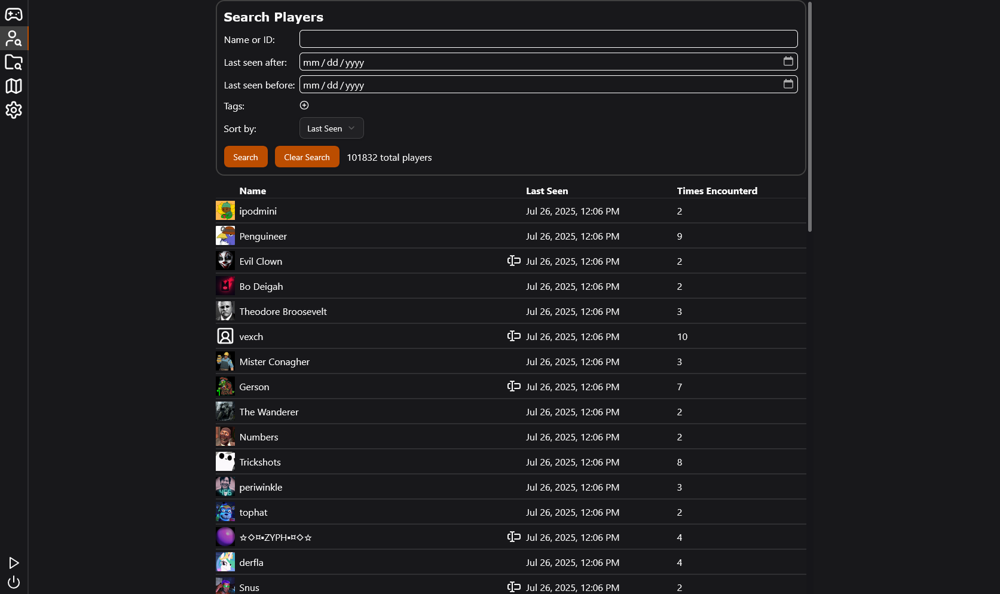

# TFView

TFView is a TF2 interface that lets you easily view and interact with various things. It works by connecting to your TF2 console and gathering data by running console commands, similarly to [TF2BD](https://github.com/PazerOP/tf2_bot_detector) and [MegaAntiCheat](https://github.com/MegaAntiCheat/client-backend). This is intended by Valve, and does not put you at risk of being banned.

## Features

### Game View

Game view lets you get an overview of the people currently in your game. TFView can be configured to show any of the following: k/d, killstreak, ping, class (based on killfeed), health (only for teammates), and number of times you have encountered someone. You can also give users nicknames, notes, and configurable tags. There are panels available to view the chat and killfeed as well.

### Player/Game Search

The main appeal behind TFView is that it stores the games you play and the people you meet so you can look them up later. For each player, you can see how many times you've seen them, the matches in which you saw them, their k/d during that match, and any demos you may have recorded during that match.

### Casual Map Selection

TFView lets you create several profiles with different casual map selections, which you can then easily switch between. You need to hit "Load Saved Settings" in-game for the changes to apply if the game is active.

### Weapon Kill Count Tracker

TFView tracks the number of kills you get with each weapon, letting you see how much you've used them. It also displays special kill types, showing you backstabs, headshots, penetration kills, taunt kills, and more.

## Installation

* Download the windows or linux zip from [the latest release](https://github.com/TheLazySquid/TFView/releases/latest)
* Extract it somewhere
* Run the tfview executable
* Open the UI at [http://localhost:7523](http://localhost:7523) and follow the setup steps

## Usage

Run the TFView executable, then optionally open the UI at [http://localhost:7523](http://localhost:7523). You can open this in the browser of your choosing or even the steam overlay.

## Necessary Setup

You will be walked through setup upon opening TFView for the first time. There are a few things that need to be done in order to connect to RCON.

1. Add `-condebug -conclearlog -usercon -g15` to your TF2 launch options.
2. Add `ip 0.0.0.0`, `rcon_password [your password here]`, and `net_start` to your autoexec.
3. (Optional, but strongly recommended) Get a [Steam api key](https://steamcommunity.com/dev/apikey). This lets you see the profile pictures of the players in your game.
4. (Optional) Get a [MegaAntiCheat api key](https://megaanticheat.com/provision) to send demos of games you play to MegaAntiCheat's masterbase. (You will also need to run `ds_enable 2` in the console).

## Storage Usage

TFView uses a surprisngly small amount of storage space. Even with 100,000 different players and 6,500 different games recorded the database only uses roughly 42 megabytes.